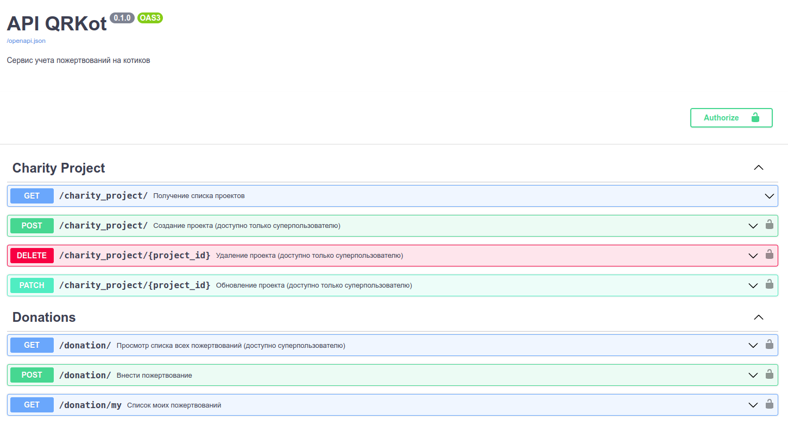

# QRkot - API для благотворительного фонда поддержки нуждающихся 😼

## Описание

Сервис с API для благотворительного фонда поддержки на FastAPI. Фонд собирает пожертвования на различные целевые проекты. У каждого проекта есть название, описание и сумма, которую планируется собрать. После того, как нужная сумма собрана, проект закрывается. Пожертвования не целевые и распределяются по проектам по принципу FIFO. Проекты создаются/обновляются администраторами. Анонимные пользователи могут просматривть проекты - как открытые, так и закрытые. Зарегистрированные пользователи могут вносить пожертвования и просматривать список своих пожетвований. При первом запуске приложения автоматически создается суперпользователь с логином и парольем указанным в env файле.

Список эндпоинтов:


## Стек

[![Python][Python-badge]][Python-url]
[![FastAPI][FastAPI-badge]][FastAPI-url]
[![SQLAlchemy][SQLAlchemy-badge]][SQLAlchemy-url]
[![SQLite][SQLite-badge]][SQLite-url]
[![Swagger][Swagger-badge]][Swagger-url]

## Установка и запуск локально

1. Клонировать репозиторий:
```
git clone git@github.com:vavilovnv/cat_charity_fund.git
```
2. Создать и активировать venv:
```
python3 -m venv venv
source venv/bin/activate
```
3. Установить зависимости:
```
pip install -r requirements.txt
```
4. Создать и заполнить .env-файл по аналогии с .env-example.

5. Применить миграции:
```
alembic upgrade head
```
6. Запустить приложение:
```
uvicorn app.main:app --reload
```
7. Открыть страницу документации (http://127.0.0.1:8000/docs) и проверить доступные эндпоинты. 

<!-- MARKDOWN BADGES & URLs -->
[Python-badge]: https://img.shields.io/badge/python%203.9+-3670A0?style=for-the-badge&logo=python&logoColor=ffdd54

[Python-url]: https://www.python.org/

[FastAPI-badge]: https://img.shields.io/badge/FastAPI-005571?style=for-the-badge&logo=fastapi

[FastAPI-url]: https://fastapi.tiangolo.com/

[SQLAlchemy-badge]: https://img.shields.io/badge/sqlalchemy-fbfbfb?style=for-the-badge

[SQLAlchemy-url]: https://www.sqlalchemy.org/

[SQLite-badge]: https://img.shields.io/badge/SQLite-07405E?style=for-the-badge&logo=sqlite&logoColor=white

[SQLite-url]: https://sqlite.org/index.html

[Swagger-badge]: https://img.shields.io/badge/-Swagger-%23Clojure?style=for-the-badge&logo=swagger&logoColor=white

[Swagger-url]: https://swagger.io/

